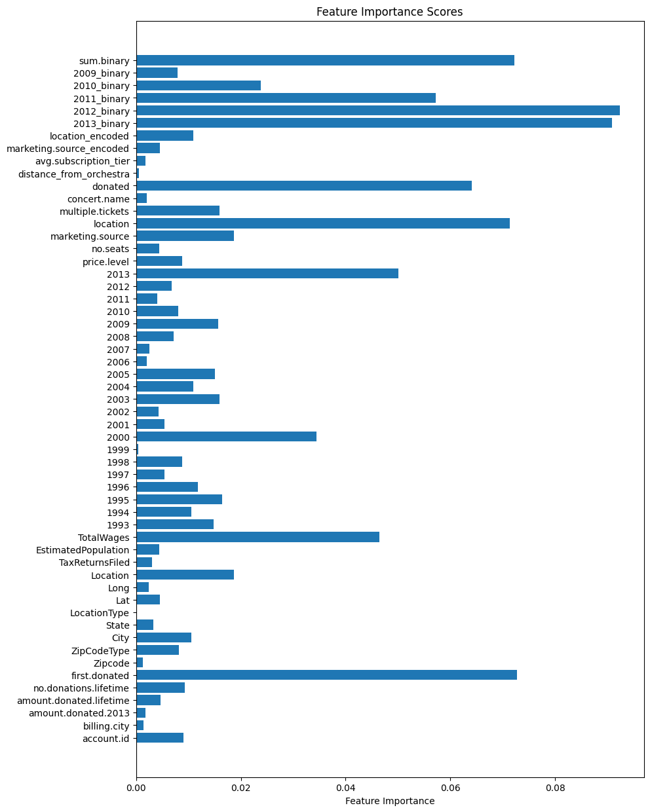

# Kaggle Competition - 520

This project involves building a machine learning model to predict whether customers will subscribe to a music concert service based on various features and historical data.

## Project Overview

The goal of this project is to develop a model that can identify potential subscribers for the upcoming season. The dataset consists of various features related to customer accounts, concert information, and subscription history. The project includes data preprocessing, feature engineering, model training, and evaluation.

## Data Sources

The project utilizes several datasets, which are loaded and processed using Python and the Pandas library:

1. **Accounts Data**: Contains customer account information, including billing details, demographics, and historical donation information.

2. **Concerts Data (2014-2015)**: Includes details about concerts that took place in 2014 and 2015.

3. **Concerts Data**: Contains information about concerts.

4. **Zipcodes Data**: Provides information about zip codes, including geographical coordinates.

5. **Subscriptions Data**: Contains information about customer subscriptions, including subscription tier and season.

6. **Tickets Data**: Includes details about concert tickets.

7. **Train and Test Data**: These datasets are used for model training and testing. The "Train" dataset contains labels indicating whether a customer subscribed, while the "Test" dataset is used for generating predictions.

## Data Preprocessing

Data preprocessing is a crucial step in preparing the data for machine learning. Several preprocessing steps are performed, including:

- Cleaning and formatting of data
- Handling missing values
- Encoding categorical variables (using Label Encoding)
- Feature engineering, such as calculating distances and aggregating subscription data

## Model Training

The primary machine learning model used in this project is the CatBoostClassifier, a gradient boosting algorithm. The model is trained using the training dataset, and hyperparameters were tuned to optimize the performance metric, which is the ROC AUC score.

## Model Evaluation

The model's performance is evaluated using the ROC AUC score on a validation dataset. The ROC AUC score measures the model's ability to distinguish between positive and negative classes. We do this because our data is highly imbalanced. 

## Generating Predictions

After training the model, it is used to generate predictions on the test dataset. The predictions are saved to a CSV file for further analysis.

## How to Run the Code

Simply run the main.py script

## How we arrived at our final model

I will briefly go through some of the iterations of my model and preprocessing design to show how I arrived at the final model that I ended up using. At this point I was not using concerts.csv or tickets_all.csv 

### Logistic Regression
My first thought was to put everything into a logistic regression. On my first iteration, I accidentally predicted 1 or 0, rather than a probability, making my AUROC only 42%. Once I fixed this, my logistic regressor quickly got to 95%. I also experimented with Ridge and Lasso which helped slightly, but only got me to about 96% and the results varied a lot every run.  

### Keras Neural Network
I then used Keras to make a neural network with 3 layers, each with 32 or 64 neurons, a ReLu activation function, and adam as the optimizer. This performed slightly better, achieving 96% on the AUROC score. 

### Finetuning
Despite iterating my neural network design many, many times, I was only able to truly get to about 96.9% AUROC with a neural network using Keras. I mainly improved by doing cross-validation to tune many hyperparameters. I did not use grid search mainly because Keras, for some reason, is extremely slow. Therefore I tuned each hyperparameter independently, which may be less than ideal. 

### Starting Over
Eventually, I decided that I was stuck at 96.9% and decided to start over from scratch. I found some errors in my preprocessing, and also decided to add in concerts and tickets data into my model. 

### Switching to PyTorch
I also switched over from Keras to Pytorch after discovering that the speed is much much faster. 

### Neural Net Ensemble
I was able to surpass 97%, and even get to around 97.3% by using an ensembling method. 

Effectively, I would first split my data into a test and training set with a ration of 20/80. I then would split the remaining 80 into a validation set and a training set, again with a ratio of 80/20. I did this second step 5 times, to create 5 models each trained on a different random subset of the data. I then average the predictions from all 5 models and see the final results from them. This got me up to 97.3 AUROC.

At this point, however, I really was unsure of how to improve, until I found out about more formal ensembling methods.

### Ensemble Models

Once I found out about these, it was quite easy to try to use them. I tried XGBoost, Tabnet, RandomForest, and GradientBoostingClassifier. All of these had moderate success, however the one that performed best for me was called CatBoostClassifier. After finetuning my hyperparameters for it, I was able to get up to a score of 97.8%, a score I was pretty happy to stop at. 

Had I known before that for categorical data these kinds of classifiers are commonly preferred, I probably wouldn't have wasted so much time on the Neural Networks, and perhaps could have had the time to squeeze out some more performance from the model.

### Possible Improvements

I still have quite a few ideas on how to improve. 

#### Finetuning Hyperparameters Using GridSearch

First, I would like to finetune my model's hyperparameters using gridsearch, it seems likely that this could add a little bit of extra performance.

#### Train on all data
 I also think that it could make sense for me to train on all of the data for when I do the final submission. This is something I hadn't been doing because of how the Neural Net uses the validation set to check its own performance and prevent itself from overfitting, but using catboost, it makes more sense to just train on all of the data. 

#### Better Preprocessing

I think my preprocessing most likely could be a bit better, I think I may have benefitted from thinking a little bit harder about how I fill/drop nan values, and also what a nan value might really mean in the context of the problem. I also think it may have helped me engineer features more effectively.

#### Better Feature Engineering

As you can see above, these are the important features according to my model. Although I had access to this throughout, through experimentation I typically found that removing features did not help model performance, which makes sense given knowledge of the classifier I am using. However, I do wonder if some kind of Principal Component Analysis could help me discover any interesting trends. 

I'm not sure of any more features I could create from these in general. 

#### Interesting Dual-Model Approach

I had one odd idea that may not have a ton of merit, but I feel could be worth mentioning. This effectively would be tracking which ids I almost always get wrong accross my models, attempting to group the testing data into the difficult to identify and not difficult to identify, and then train a secondary model to only predict the ones that have been difficult to identify. Most likely, this would perform worse, but I do think it is worth a shot.

#### Filling Nans using K-Means Clustering

I also thought about using K-means to try to predict what my missing values are in my data, for more accurate filling. I doubt it would make a large difference, and inherently I do wonder about the merit as you are essentially using other data to predict the data you need to train on, but again, I believe it could be worth experimenting with. 

#### SMOTE

The final thing I think could really help this algorithm is Synthetic Minority Over-Sampling Technique. I couldn't think of any good way to do it easily, but if you could manage to increase our positive class examples somehow, it could really improve our model, because we have a very small amount of data in the first place, and only about 1/20th of that data is the positive class

## Final Thoughts

Overall, I learned a lot about working with tabular data and prediction models. I learned that ensemble mdoels tend to do well with tabular data, and that neural networks might benefit from more data, but in this case, may not be the best model for the job.
